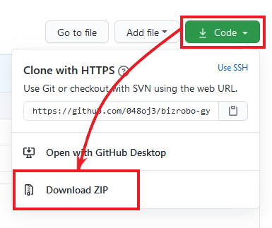

# サンプルロボットの使い方

```
自己学習を兼ねて BizRobo! Gym を操作するロボットを作ったので、誰かの参考になればと思い公開しています。
クレームが発生した場合には即時閉鎖します。
サンプルロボットは折を見て追加していく予定です。
```

以下の手順でサンプルロボットをダウンロードしてください。

1. 以下の図で示す通り画面上部の「Code」ボタンをクリックし、ドロップダウンで表示されるメッセージから「Download ZIP」を選択してZIPファイルをダウンロードしてください。
1. ダウンロードしたファイルを解凍してDesign Studioから開いてください。

 
